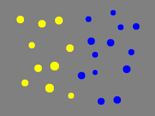
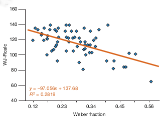
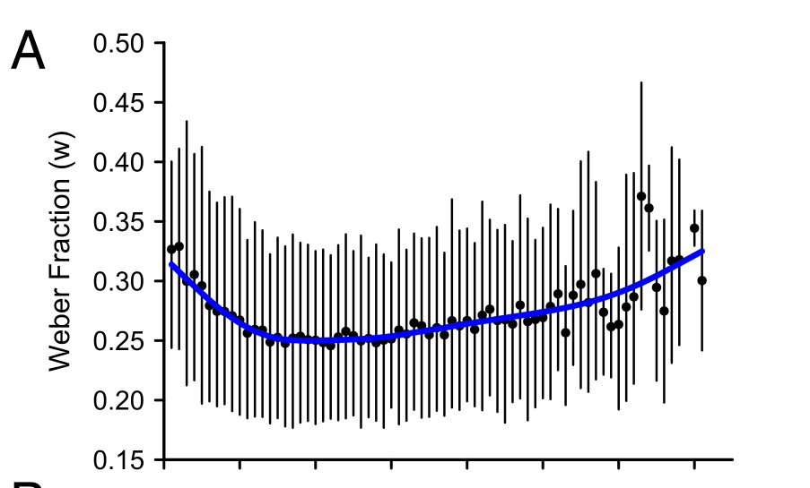
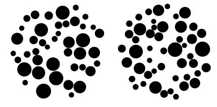

```{r setup, include=FALSE, message=FALSE}
knitr::opts_chunk$set(echo = FALSE)
library(dplyr)
library(tidyr)
library(ggplot2)
#library(gutenbergr)
library(latex2exp)
library(pander)
library(stringr)
library(readr)
library(coda)

Df <- read_csv("data/data_c8502b1.csv")
n.subjects <- length(unique(Df$subject))
load('data/ans.jul25.S.Rda')

plot.hpd <- function(S, k=1){
  m <- summary(S)[[1]][,1]
  s <- order(m)
  hpd <- HPDinterval(S)[[k]]
  
  
  N <- dim(hpd)[1]
  plot(0,0,axes=T,type='n',xlab='',ylab='',ylim=c(min(hpd), max(hpd)), xlim=c(0,N))
  
  for (i in 1:N){
     segments(i,hpd[s[i],1],i,hpd[s[i],2])
  }
  #hpd
}
```

## Approximate Number System

- The Approximate Number System (\textsc{ans}) is an innate cognitive system that allows us to estimate the cardinality of sets.
- The \textsc{ans} has been observed in infants as young as 6 months, in non-human primates, and other animals including insects.
- In children and adults, the most common type of task to investigate \textsc{ans} is where subjects which of two random dot arrays is more numerous: 
```{r, out.width = "100px", fig.align="center"}

```
- Six month old infants can accurately distinguish sets sizes if their ratio is greater than 2:1, 3 yr olds can distinguish ratios from 3:2, and adults can distinguish ratios from 10:9. 

## The relevance of \textsc{ans}

- \textsc{ans} acuity has been shown to be correlated with mathematical ability, e.g., Halberda et al (2008) *Nature*:
```{r, out.width = "200px", fig.align="center"}

```
- Some, e.g. Hyde et al (2014) *Cognition*, have argued that there is a causal relationship between \textsc{ans} and mathematical ability.

## Mental Number Line

- The putative cognitive basis of the \textsc{ans} is a probabilistic mental representation of numerical quantities known as the *mental number line*.
- A widely held model describes the representation of the set size $n$ as a Gaussian centered on $n$ with standard deviation proportional to $n$.

```{r, out.width = "200px", fig.align="center"}
n <- c(4, 6, 10, 15, 20, 25)
 ggplot(data.frame(x = c(0, 35)), aes(x)) + 
  mapply(function(mean, sd, col) {
    stat_function(fun = dnorm, args = list(mean = mean, sd = sd), col=col, size=2, n=1000)
  }, 
  # enter means, standard deviations and colors here
  mean = n, 
  sd = n/5,
  col=c('red', 'green', 'blue', 'orange', 'cyan', 'magenta')
) + theme_classic() + theme(legend.position="none")
```

## Measuring \textsc{ans} acuity

- According to the Gaussian *mental number line* model, the probability the set $k$ is judged as greater than set $l$ by subject $j$ 
is obtained from the area under the curve of the difference of two Gaussians:
$$
\Prob{x_k > x_l} = \int_0^\infty N\left(n_k - n_l, \omega_j \cdot (n_k^2 + n_l^2)\right).
$$
- Here, $\omega_j$ is the \textsc{ans} acuity of subject $j$, referred to as the *Weber fraction* (the smaller $\omega_j$, the narrower the Gaussians of the mental number line, and so the better their ability to distinguish between different set sizes). 
- Crucially, $\omega_j$ is estimated solely on the basis of the subject's classification accuracy.

## \textsc{ans} acuity as speeded decision making

- Relative set size of random dot arrays is a paradigm example of a two alternative forced choice task.
- It is well established that in these tasks, speed of response may be traded off for increased accuracy and vice versa. 
- It is arguable therefore than an improved measure of \ans acuity can be obtained by modelling individuals' performance using sequential sampling model, which have been well established as accurate models of speeded decision making.

## The present study 

- We collected data from adults performing a standard \ans (relative magnitude) task.
- Their performance was analysed using a Bayesian hierarchical drift diffusion model.
- In ongoing work,
  - A larger group of (young) adults performed the \ans task and had their mathematical ability measured by a set of standardized test of arithmetic and numerical ability.
  - Another larger group of people from ages 16 to 80 performed the \ans task.
```{r, out.width = "0.5\\textwidth", fig.align="center"}

```

## The experimental task

- On each trial, a pair of random dot arrays was displayed. Subjects chose the larger with a mouse click. 
```{r, out.width = "300px", fig.align="center"}

```
- The set size of every array was in the range $(40, 60)$; the volume of the convex hull and the density of every array were identical; the radius of all constituent dots varied randomly. 

## Subjects and procedure

```{r}
Df.subjects <- Df %>% 
  select(subject, sex, age) %>% 
  distinct() 

Df.sex <- Df.subjects %>% 
  group_by(sex) %>% 
  summarize(count = n())

gender.counts <- Df.sex$count
names(gender.counts) <- Df.sex$sex

```

- A total of $n=`r sum(gender.counts)`$ people ($`r gender.counts['Female']`$ female, $`r gender.counts['Male']`$ male, $`r gender.counts[3]`$ gender not stated) took part
- The \nth{1}, \nth{2}, \nth{3} age quartiles are `r quantile(Df.subjects[['age']], na.rm=T, probs = c(.25, .5, .75))`, respectively. 
- Each session had 5 blocks of 100 trials. 
- On each trial, the participant was asked to click (as quickly and as accurately as possible) on the dot array that they perceived to be larger. 
- The median number of completed trials was `r median((Df %>% group_by(subject) %>% count())$n)`.
- The experiment duration was approximately 15-20 minutes.

## Speed versus accuracy (averaged across subjects)

```{r, message=FALSE}
Df.summary <- mutate(Df, 
                     subject = str_sub(subject, 1, 3)) %>%
  group_by(subject) %>%
  summarise(accuracy=mean(accuracy),
            latency=mean(rt)) 

Df.summary %>%
  ggplot(mapping=aes(x=accuracy, y=latency, label=subject)) +
  #geom_point() +
  geom_text(check_overlap = T) + 
  geom_smooth(method='lm') + 
  theme_classic()

cor.coef <- cor(Df.summary$latency, Df.summary$accuracy)

```

\framesubtitle{$N=`r n.subjects`$, $r=`r round(cor.coef,2)`$}

## Hierarchical drift diffusion model

```{r, out.width = "300px", fig.align="center"}
knitr::include_graphics("figs/diffusion.pdf")
```

## Hierarchical drift diffusion model

- The response of each subject on each trial is modelled by the first passage times of an upper or lower barrier of a Wiener diffusion process.
- Each subject is modelled as having a single fixed but unknown non-decision interval for all their trials. Across subjects, these intervals are modelled hierarchically as (truncated) normally distributed random variables.
- Likewise, each subject has a single fixed but unknown inter-barrier distance for all trials. Across subjects, these intervals are also modelled hierarchically as (truncated) normally distributed random variables.
- The starting position of the diffusion process on all trials and for all subjects is set at 0.5 (i.e. equidistant from the upper and lower barriers).
- The mean drift rate on each trial is modelled as a linear function of the difference between the sizes of the two sets.
- The slope and intercept of these linear functions are modelled hierarchically across subjects. 

## Posterior distribution of non-decision time
\framesubtitle{95\% high-posterior density (\textsc{hpd}) intervals per subject}

```{r}
plot.hpd(S.terr.individual)
```
- \small  Participant with largest non-decision-time value is *2ac*.

## Posterior distribution of boundary separation
\framesubtitle{95\% \textsc{hpd} intervals per subject}

```{r}
plot.hpd(S.boundary.individual)
```
- \small  Participant with largest boundary separation value is *838*, followed by *76f*, *3d1*, etc.


<!-- ## Posterior distribution of intercept (linear model of drift rate) -->
<!-- \framesubtitle{95\% \textsc{hpd} intervals per subject} -->

<!-- ```{r} -->
<!-- plot.hpd(S.0) -->
<!-- ``` -->

## Posterior distribution of slope (linear model of drift rate)
\framesubtitle{95\% \textsc{hpd} intervals per subject}

```{r}
plot.hpd(S.1)
```

- \small  Participant with largest slope value is *e84*, followed by *62a* (high non-decision-time), *79b*, etc.

## Conclusions & future directions

- Accuracy alone, or reaction time alone, can be a very misleading measure of \textsc{ans} acuity.
- Participants differ greatly in their speed-accuracy trade-offs and their non-decision-times. 
- Efficiency of processing numerical quantities may be best measured by the rate of change of the drift rate with set size difference.
- Ongoing work:
  - Analyse the relationship between rate of change of drift rate and mathematical ability.
  - Analyse change in \textsc{ans} acuity over the lifespan.
  - Analyse symbolic numerical judgements using diffusion models.
  
## Park & Starns (2015)

- Park, Starns (2015) *The Approximate Number System Acuity Redefined: A Diffusion Model Approach* provide a non-hierarchical (non Bayesian) drift diffusion model of ANS performance in an almost identical task to that used here.
- They conclude that drift rate is the key variable measure \textsc{ans} acuity.
- They show a relationship drift rate and symbolic mathematical ability.
